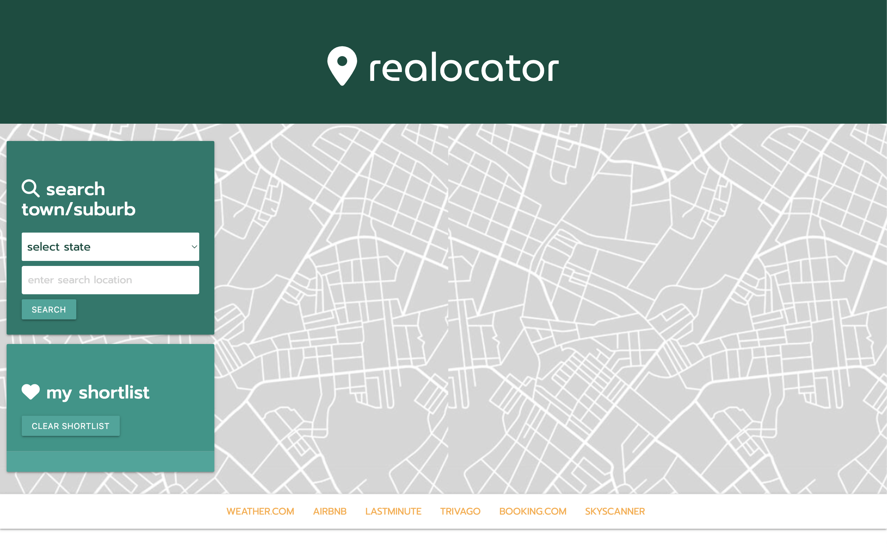

# Realocator
Realocator will be a simple web app that allows people to:

•			Search for properties for sale in a specified location 

•            Make a shortlist of those preferred properties

•            Check the weather for those shortlisted properties

•            Have links to relevant sites such as www.domain.com.au and www.airbnb.com.au 


## Collaborators
Project One: Rodney Parker-Yules, Nicholas Strong, Trentan Jurkans and Sean Wallace. 

## User Story

```
As a property buyer, I want to view properties for sale in a specified location. I want to save properties of interest into a shortlist and I want to view the weather for those locations.

```
## Acceptance Criteria

```
GIVEN I am looking to buy property

WHEN I enter a state and city or suburb
THEN I am given a list of properties for sale in that location

WHEN I click on the “shortlist” button in list of properties for sale 
THEN a button is created in the shortlist section displaying the address of the chosen property

WHEN I click on a property in the shortlist
THEN I am given the weather details for the location of that property

WHEN I reload the page 
THEN my previous shortlist selections are displayed

WHEN I click the Clear Shortlist button 
THEN the shortlist of properties and weather is cleared

WHEN I view the page on a mobile device
THEN the page responds and automatically scrolls to the relevant part of the page

```

## Mock-Up

The following image shows the applications logic flow:


The following image shows the applications user inferface:


## Deployed Application
Realocator is here: https://seanu2022.github.io/realocater/ 

Realocator repository is here: https://github.com/SeanU2022/realocater

## Future Design Documentation
Refer to RealocatorDesignDocumentV3.0.pdf in the assets sub folder.